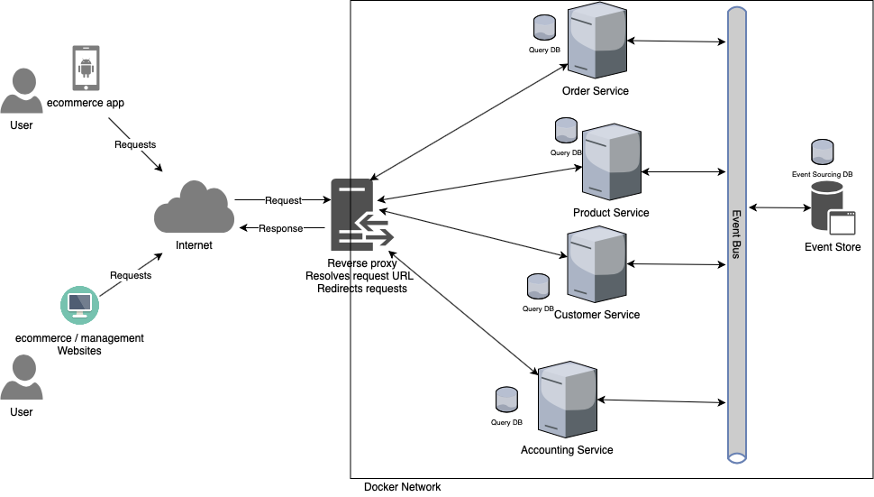
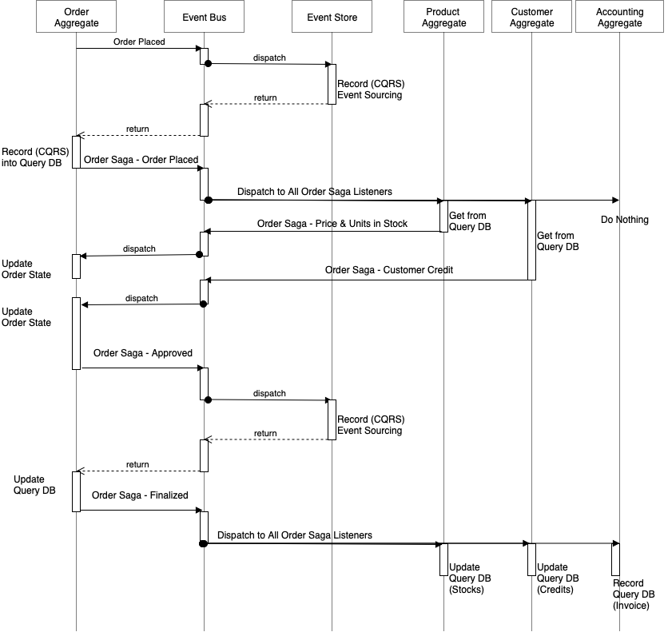

# YggFinance

## Introduction: What is YggFinance?

`Short Description of our program`

## Implemented Technologies and Concepts

- Microservices pattern
- CQRS
- Event Bus
- Event Store
- Database per Service
- Event Broker Pattern
- Saga - Choreography
- Reverse Proxy
- VPN Gateway
- Firewall
- RESTful services
- Java
- Python
- Node.js
- VSCode
- Git
- Docker
- `etc. add as we decide`

## Program Constraints

1. The project must be completed and deployed by ~May 5 (~3 months).
2. The project must utilize Git and Github for version control.
3. The program should incorporate new technologies.
4. `etc...`

## User Stories

Template: As a [ USER ] I want to [ ACTION ] So that [ REASONING ]

User Personas:

1. User: The end user of the application
2. `etc. add once defined`

<!-- markdownlint-disable MD033 -->
<table>

<tr><th>User Story</th><th>Acceptance Criteria</th></tr>

<tr><td>
As a User, I want to see my FIRE number So that I can better understand when I will be able to retire.
</td><td><ul><li>
    Application can Calculate FIRE number
</li></ul></td></tr>

<tr><td>
<b>Etc.. Add many of these to get a good idea of the features</b>
</td><td><ul><li>
    <i>What must be done to make the story a reality</i></li><li>
    <i>Often more than one thing needs to be done per story</i>
</li></ul></td></tr>

</table>
<!-- markdownlint-enable MD033 -->

## Aggregates

Basically take all the Acceptance Criteria and group them into rough Categories. Those Categories are your Aggregates. The Aggregates lay the groundwork for what each individual service will end up doing, and helps to get a grasp on what each service in your project will be called and mean on a higher level.

### Retirement

- Application can Calculate FIRE number

### `Example` (as in an aggregate for the previous user story example)

- `What must be done to make the story a reality`
- `Often more than one thing needs to be done per story`

## Modules

| Module | Category  | Programming Language | Sdk | Docker |
| ------ | --------- | -------------------- | -------- | ------ |
|User WebApp|Consumer|`TODO`|`TODO`|[`TODO`](https://hub.docker.com/)|
|VPN Gateway|Support Tool|-|-|[`TODO`](https://hub.docker.com/)|
|Firewall|Support Tool|-|-|[`TODO`](https://hub.docker.com/)|
|Reverse Proxy|Support Tool|-|-|[nginx:alpine](https://hub.docker.com/_/nginx)|
|Event Bus|Support Tool|-|-|[rabbitmq:management](https://hub.docker.com/_/rabbitmq)|
|Event Store|Support Tool|`TODO`|`TODO`|[`TODO`](https://hub.docker.com/)|
|Retirement Database|Database|-|-|[`TODO`](https://hub.docker.com/)|
|`Example` Database|Database|-|-|[`TODO`](https://hub.docker.com/)|
|Retirement Service|Service|`TODO`|`TODO`|[`TODO`](https://hub.docker.com/)|
|`Example` Service|Service|`TODO`|`TODO`|[`TODO`](https://hub.docker.com/)|

## API by Service

Each API endpoint (think of it like functions that the UI calls) provided by each service for program functionality.

| Retirement (`ProgrammingLanguage`) |  `Example` (`ProgrammingLanguage`) |
| ---------------------------------- | ---------------------------------- |
| get-fire-number                    | `add-example-data`                 |
| `TODO`                             | `TODO`                             |
| `TODO`                             | `TODO`                             |
|                                    | `TODO`                             |
|                                    | `TODO`                             |

## Communication Topography

A Diagram detailing the topology of the project.

`Below is an example diagram from this project` [Microservices](https://github.com/ayhanavci/Microservices)

## Sagas

### `TODO` Saga

`TODO`

`Below is an example saga diagram from this project` [Microservices](https://github.com/ayhanavci/Microservices)

## Running the Project

`TODO`

## Licence

GNU General Public License v3.0

## Authors

Alan Holman 2021  
aholman7@my.apsu.edu

Blake Hudson 2021  
chudson21@my.apsu.edu

Austin Kerr 2021  
akerr4@my.apsu.edu
