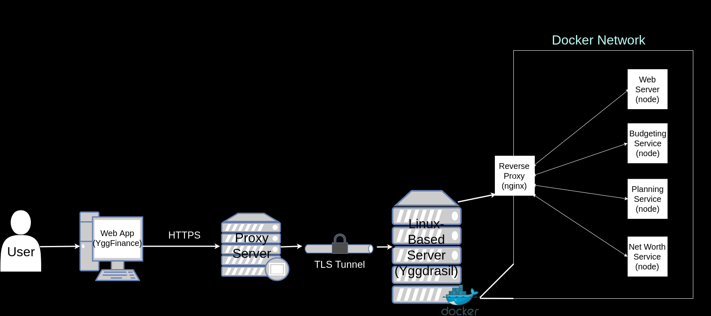

# YggFinance

## Introduction: What is YggFinance?

YggFinance aims to help our end users gain a better grasp on three major areas of their personal finance ー Monthly Budgeting, Savings Planning, and Net Worth Tracking. YggFinance offers tools for each of these categories that aim to make it easier for our end users to track personal spending trends, to compare strategies for personal savings goals, and to gain insight into their current net worth.

## Project Proposal

See our [Project Proposal](https://docs.google.com/document/d/1nkHFe5301lCNpXaoW17DRWBJwUDSga3-ieydW12w5K4/edit) Google Docs for the most up to date version.

Alternatively, we include an archived PDF version of this file within this repo [here](documentation/Proposal.pdf).

## Project Schedule

See our [Project Schedule](https://docs.google.com/spreadsheets/d/1z0qx8BHvJfu07h4-Id_6jOLh6xy1ZivX3l5OgTq2Dmk/edit) Google Sheets for the most up to date version.

## Project  Requirements

See our [Requirements Document](https://docs.google.com/document/d/183tJPdbQjW1SCaJoEjVqWTh_mHdAAX0H52b6hTXzoHs/edit) Google Docs for the most up to date version.

Alternatively, we include an archived PDF version of this file within this repo [here](documentation/Requirements.pdf).

## Project Design

See our [Design Document](https://docs.google.com/document/d/1cupP7yOYICyA_QUDTlE-oBpe0ZhrcVWDnqxv1n_v0fs/edit) Google Docs for the most up to date version.

Alternatively, we include an archived PDF version of this file within this repo [here](documentation/Design.pdf).

## Technologies

### Concepts

- Containerization
- Microservices pattern
- Web Application
- Local Storage
- Stateless Server
- RESTful Services

### Deployment

- Docker
- Docker Networks
- Self-Hosted Server
- Ubuntu Server
- Localhost Tunneling

### Communication Standard

- HTTP Request Type
- JSON Message Format

### Development Environments

- VSCode
- React.js
- Code-OSS
- Node.js
- Git
- TortoiseGit
- GitHub
- Windows 10
- Linux (Manjaro & Ubuntu)

### Design/Documentation Tools

- Google Docs/Slides/Sheets
- Libre Office
- Microsoft Office
- [app.diagrams.net](app.diagrams.net)

### Team Communication Platforms

- Discord
- Zoom
- Email (MS Outlook)

## Project Constraints

1. The project may be a standalone application, or a client/server application.
2. The project may be targeted towards one specific operating system or multiple operating systems.
3. The project may be targeted to traditional computers and/or tablets and smartphones.
4. The project must involve a significant amount of custom programming.
5. You many make a game, but by the end of the semester it must have several fully functional and playable levels (or the equivalent).
6. The project should not use of tools that do a significant amount of work for you in place of you coding.  For example, if making a game, you may not use Unity or any equivalent tool.
7. All usage of images, sounds, fonts, code libraries, tools, etc. must adhere to the item’s license.
8. The project must be completed and deployed by ~May 5 (~3 months).
9. The project must utilize Git and Github for version control.

For a short functional overview of where our technologies apply, see the table below:

| Module             | Category     | Programming Language | Sdk      | Docker                            |
| ------------------ | ---------    | -------------------- | ----------- | --------------------------------- |
| YggFinance WebApp  | Consumer     | JavaScript           | React       | [node:XX](https://hub.docker.com/_/node) |
| Reverse Proxy      | Support Tool | -                    | -           | [nginx:alpine](https://hub.docker.com/_/nginx) |
| Budgeting Service  | Service      | JavaScript           | Node        | [node:XX](https://hub.docker.com/_/node) |
| Planning Service   | Service      | JavaScript           | Node        | [node:XX](https://hub.docker.com/_/node) |
| Net Worth Service  | Service      | JavaScript           | Node        | [node:XX](https://hub.docker.com/_/node) |

## Communication Topography

A Diagram detailing the topology of the project.

## Running the Project

`TODO`

## Licence

MIT License

## Authors

Alan Holman 2021  
aholman7@my.apsu.edu

Blake Hudson 2021  
chudson21@my.apsu.edu

Austin Kerr 2021  
akerr4@my.apsu.edu
