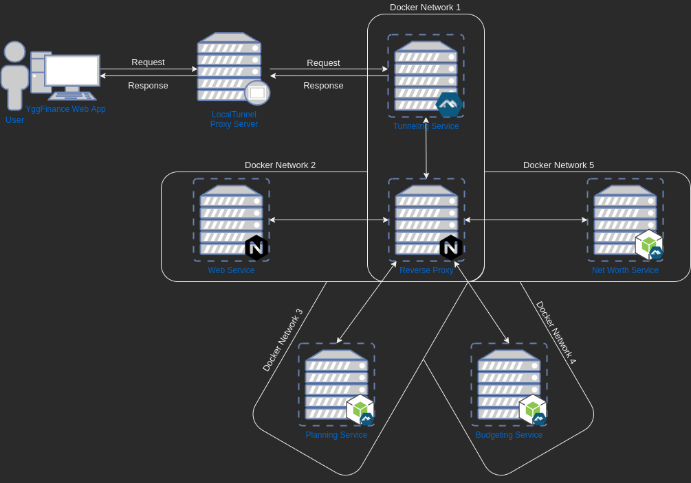

# YggFinance

## Introduction: What is YggFinance?

YggFinance aims to help our end users gain a better grasp on three major areas of their personal finance ー Monthly Budgeting, Savings Planning, and Net Worth Tracking. YggFinance offers tools for each of these categories that aim to make it easier for our end users to track personal spending trends, to compare strategies for personal savings goals, and to gain insight into their current net worth.

## Running the Project

### Release

To run the most recent release, see the instructions in the [README.md](release/README.md) in the [release](./release) directory

### Source

To build and run the project from source, see the instructions in the [README.md](src/README.md) in the [src](./src) directory

## Project Constraints

- The project may be a standalone application, or a client/server application.
- The project may be targeted towards one specific operating system or multiple operating systems.
- The project may be targeted to traditional computers and/or tablets and smartphones.
- The project must involve a significant amount of custom programming.
- You many make a game, but by the end of the semester it must have several fully functional and playable levels (or the equivalent).
- The project should not use of tools that do a significant amount of work for you in place of you coding.  For example, if making a game, you may not use Unity or any equivalent tool.
- All usage of images, sounds, fonts, code libraries, tools, etc. must adhere to the item’s license.
- The project must be completed and deployed by ~May 5 (~3 months).
- The project must utilize Git and Github for version control.

## Project Deliverables

### Proposal

[Document](documentation/docs/Proposal.pdf)

### Requirements

[Document](documentation/docs/Requirements.pdf)

[Presentation](documentation/presentations/Requirements.pdf)

[Presentation (pptx)](documentation/presentations/Requirements.pptx)

### Design

[Document](documentation/docs/Design.pdf)

[Presentation](documentation/presentations/Design.pdf)

[Presentation (pptx)](documentation/presentations/Design.pptx)

### Update

[Document](documentation/docs/Update.pdf)

[Presentation](documentation/presentations/Update.pdf)

[Presentation (pptx)](documentation/presentations/Update.pptx)

### Final

[Report](documentation/docs/Final_Report.pdf)

[Presentation](documentation/presentations/Final_Presentation.pdf)

[Presentation (pptx)](documentation/presentations/Final_Presentation.pptx)

## Service Design

| Module             | Category     | Programming Language | Sdk      | Docker                            |
| ------------------ | ------------ | -------------------- | ----------- | ------------------------------------------------ |
| YggFinance WebApp  | Consumer     | JavaScript           | Node        | [nginx:alpine](https://hub.docker.com/_/nginx)   |
| Reverse Proxy      | Support Tool | -                    | -           | [nginx:alpine](https://hub.docker.com/_/nginx)   |
| Tunneling Utility  | Support Tool | Bash                 | -           | [node:14-alpine](https://hub.docker.com/_/node) |
| Budgeting Service  | Service      | JavaScript           | Node        | [node:14-alpine](https://hub.docker.com/_/node)  |
| Planning Service   | Service      | JavaScript           | Node        | [node:14-alpine](https://hub.docker.com/_/node)  |
| Net Worth Service  | Service      | JavaScript           | Node        | [node:14-alpine](https://hub.docker.com/_/node)  |

## Communication Topography

## Technologies

### Concepts

- Containerization
- Microservices pattern
- Web Application
- Local Storage
- Remote Proxy

### Deployment

- Docker
- Docker Compose

### Communication

- HTTP Requests
- JSON
- HTML Forms
- [LocalTunnel](https://localtunnel.github.io/www/)
- [Nginx](https://www.nginx.com/)

### Programming

- Node.js
- React.js
- Material UI
- Bash

### Development Environments/Tools

- VSCode
- Git
- TortoiseGit
- GitHub
- Windows 10
- Linux (Manjaro & Ubuntu)

### Design/Documentation Tools

- Google Docs/Slides/Sheets
- Microsoft Office
- [app.diagrams.net](app.diagrams.net)

### Team Communication Platforms

- Discord
- Zoom
- Email (MS Outlook)

## Licence

MIT License

## Authors

Alan Holman 2021  
aholman7@my.apsu.edu

Blake Hudson 2021  
chudson21@my.apsu.edu

Austin Kerr 2021  
akerr4@my.apsu.edu
