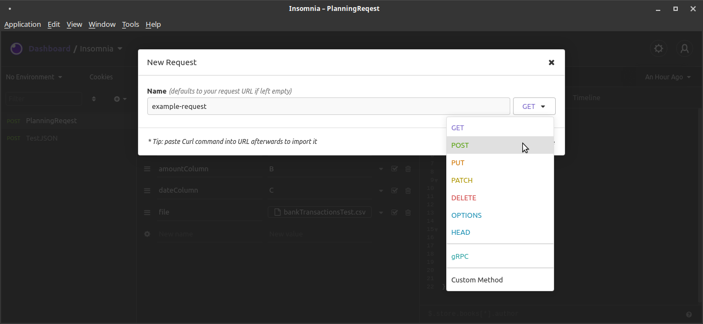

# NetWorth Service

webserver that consumes an HTTP POST request on localhost:8080 of `Content-Type="application/json"` with a req.body of the form:

```JSON
{
   "assets": {
      "realEstateValue": number,
      "checkingAccountsBalance": number,
      "savingsAccountsBalance": number,
      "retirementAccountsBalance": number,
      "automobilesValue": number,
      "other": number
      },
   "liabilities": {
      "remainingMortgageBalance": number,
      "consumerDebt": number,
      "personalLoans": number,
      "autoLoans": number,
      "studentLoans": number,
      "other": number
      },
   "netWorth": number
}
```

and is expected to send a response (res) of `Content-Type: "application/json"` with a body of the form:

```JSON
{
   "endBalance": number,
   "timeFrame": number,
   "startingAmount": number,
   "totalContributions": number,
   "totalInterest": number
}
```

## Building

- RUN `npm install` from the `src/networthService` folder
- RUN `docker build -t networth-service .`

## Running

- RUN `docker run -dp 8080:8080 networth-service`

## Monitoring

- RUN `docker ps`
   1. COPY the name of the running container `<name>`
- RUN `docker logs -f <name>`

## Testing

For Testing that the Service is properly receiving and responding to requests, we will be using [Insomnia](https://insomnia.rest/).

1. Install [Insomnia](https://insomnia.rest/)
2. Open the Base Collection called "Insomnia" 
3. Create a new request 
4. Name the request whatever you want (this is for you to keep track of different requests and has no bearing on the request itself).
5. Change the request method to a POST request 
6. Change the request body to JSON 
7. Hit the create button
8. Set the request URL to `http://localhost:8080` 
9. Fill in test data in the correct form (see description at top of this readme) 
10. Send the request
11. If you have properly handled the request in the service:
    1. You should now receive a response code of `200 OK` from the service, with a body of the form mentioned in the description at the top of this page. 
    2. If you follow the steps listed in the [Monitoring Section](##Monitoring), you will be able to see the output of your service when it receives the request.
    3. With the default setup, your output should look something like this 
12. **Congratulations!** you are all set for testing your service! From here all you need to do is fiddle with the values you send in your request to test how your API handles different request values.
